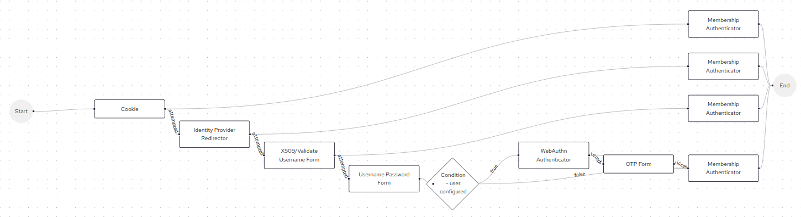

# Keycloak Membership Authenticator

A simple Keycloak Authenticator that checks if the user is a member of one of the provided groups. If not, the authentication flow is stopped, and a custom error message is returned to the user.

The authenticator must be configured in the authentication flow in such a way that it is triggered after another authenticator has successfully established the user's identity and set the user in the authentication session. This allows the authenticator to execute the context.getUser() method. Otherwise, the flow will crash, returning an unexpected error, which will be reported in the server logs.

## Instalation

Download a release (*.jar file) that is compatible with your Keycloak version from the list of releases and copy the downloaded .jar file to the `provider/` directory. Run `bin/kc.sh build` command and then start the Keycloak server.

## Configuration

Create a subflow for each alternative authentication flow you have, add a new step, and select 'Membership Authenticator.' Open the step settings and fill in the configuration fields. The fields are quite straightforward. An example is shown below.

Your final flow diagram could resemble the following.

## Issues
This authenticator does not function when the user logs in with an Identity Provider because the changes from PR [12891](https://github.com/keycloak/keycloak/pull/12891) have not yet been implemented in Keycloak.
