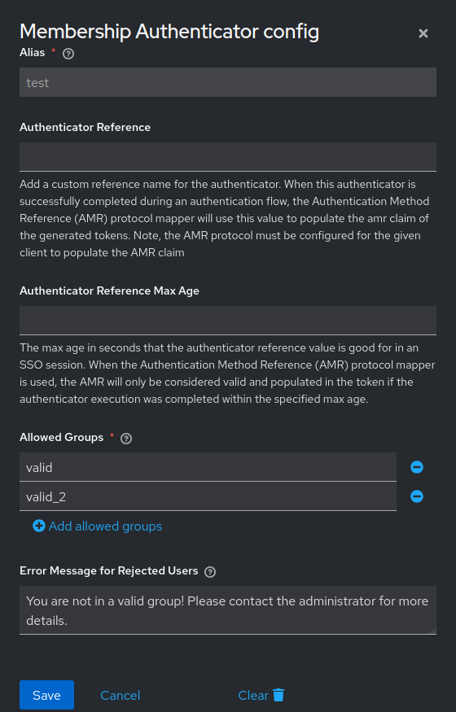
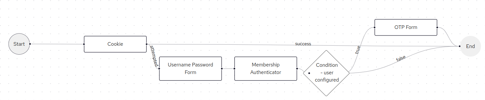

# Keycloak Membership Authenticator

A simple Keycloak Authenticator that checks if the user is a member of one of the provided groups. If not, the authentication flow is stopped, and a custom error message is returned to the user.

The authenticator must be used after the validation step that successfully authenticates the user, allowing Keycloak to execute the context.getUser() method. Otherwise, the flow crashes, returning an unexpected error. The problem is reported in the server logs.

## Instalation

Download a release (*.jar file) that is compatible with your Keycloak version from the list of releases and copy the downloaded .jar file to the `provider/` directory. Run `bin/kc.sh build` command and then start the Keycloak server.

## Configuration

Create a new authentication flow, add a new step, and select 'Membership Authenticator.' Open the step settings and fill in the configuration fields. The fields are quite straightforward. An example is shown below.

Your final flow diagram should resemble the following.

